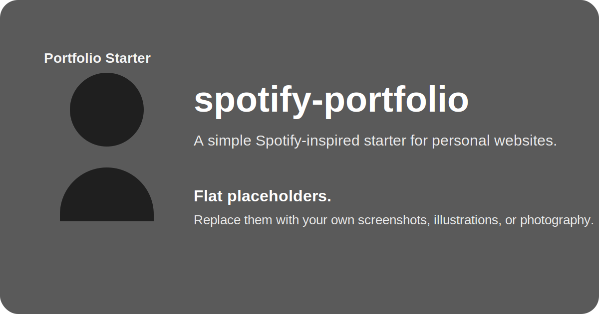

# spotify-portfolio

A Spotify-inspired portfolio starter built with Next.js 15, Tailwind CSS, and TypeScript.



## Quick Start

```bash
npm install
npm run dev
```

Open [http://localhost:3000](http://localhost:3000).

## Customize This Template

Start with these files:

- `src/config/site.ts`: name, metadata, social links, widgets, and site-wide settings
- `data/experience.ts`: experience timeline
- `data/projects.ts`: project cards and featured work
- `src/content/blog/*.md`: markdown blog posts
- `public/`: avatar, social preview image, project art, and blog art

## Optional Widgets

- GitHub contributions: add `widgets.githubUsername` in `src/config/site.ts`
- Spotify embed: add `widgets.spotifyEmbedUrl` in `src/config/site.ts`
- Vercel analytics: flip the feature flags in `src/config/site.ts`

## Docker

Build the production image:

```bash
docker build -t spotify-portfolio .
docker run --rm -p 3000:3000 spotify-portfolio
```

Run the dev container with hot reload:

```bash
docker compose -f docker-compose.dev.yml up
```

## Deployment Notes

- Update `siteUrl` in `src/config/site.ts` before deploying.
- Replace the starter media in `public/` so your social cards and thumbnails match your work.
- Run `npm run build` before publishing.

More detailed guidance lives in [docs/customization.md](docs/customization.md).
